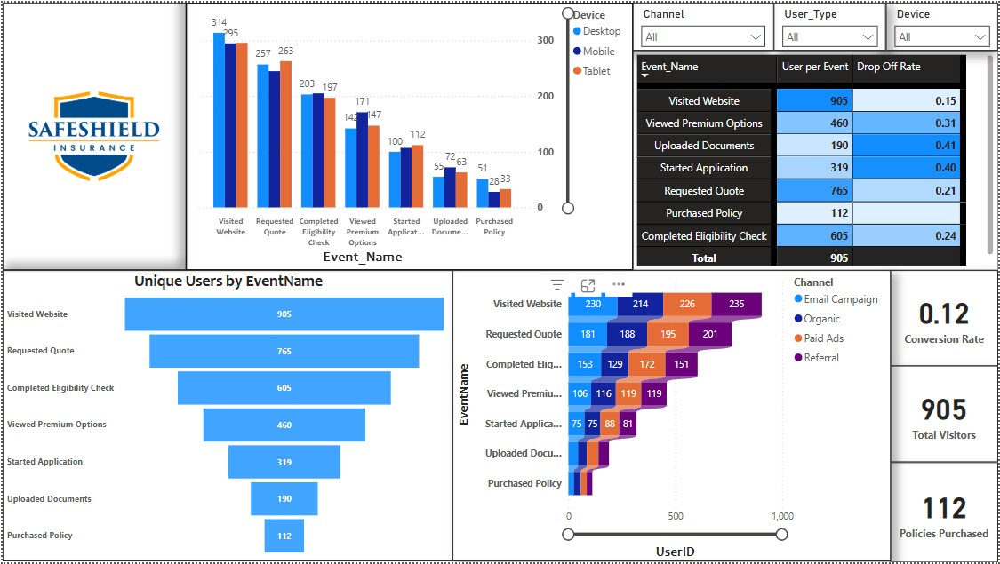

# Insurance Policy Funnel Drop-off Analysis (Power BI Project)

🚀 **Project Summary**  
This Power BI project analyzes a simulated insurance policy purchase funnel for SafeShield Insurance to identify major user drop-off points and propose data-driven improvements to boost conversion rates.

🔹 **Note:**  
This project uses a **simulated dataset** created independently for portfolio development purposes. It does not represent actual company data.

---

## 📊 Dashboard Highlights:
- **Funnel Chart:** User journey from website visit to policy purchase across 7 funnel stages.
- **Clustered Bar Chart:** Device-wise (Desktop, Mobile, Tablet) drop-off analysis.
- **Stacked Bar Chart:** Channel-wise performance (Organic, Paid Ads, Email Campaign, Referral).
- **Matrix Table:** Drop-off rates (%) between funnel stages.
- **KPI Cards:** Total Visitors, Total Policies Purchased, Overall Conversion Rate.
- **Interactive Slicers:** Filter by Device Type, Marketing Channel, and User Type (New vs Returning).

---

## 🧱 Data Modeling & DAX:
- Simulated and cleaned insurance funnel dataset.
- Built DAX measures for Unique Users, Drop-off Rates, and Conversion Metrics.
- Implemented responsive visuals with dynamic segmentation.

---

## 🧠 Key Insights:
- Highest drop-offs observed after users viewed premium options and during application/document upload stages.
- Mobile users showed slightly higher abandonment rates.
- Organic and Referral channels performed better compared to Paid Ads.
- Returning users had better funnel completion rates.

---

## 🛡️ Impact Delivered:
This dashboard uncovered critical leakage points in the insurance policy purchase funnel, particularly during the transition from **Viewing Premium Options** to **Starting Application**, and from **Application Started** to **Document Upload**, where more than **35–40% of users** dropped off at each step.  
Device segmentation revealed that **Mobile users** experienced slightly higher abandonment rates, indicating potential for UI/UX improvements on mobile forms and document upload flows.  
Channel analysis showed that **Organic and Referral** users converted better than **Paid Ads** users, highlighting opportunities to optimize ad targeting and messaging strategies.  
By addressing these friction points, SafeShield Insurance could realistically drive a **5–7% increase** in overall policy conversion, improving customer acquisition rates while reducing marketing inefficiencies.

---

## 📁 Project Files:
- `insurance_funnel_dashboard.pbix` - Power BI Dashboard file
- `dashboard_screenshot.png` - Dashboard preview image

---

## 📩 Connect with me:
Feel free to connect with me on [LinkedIn](https://www.linkedin.com/in/spandanmaharana/) to discuss analytics, Power BI, and data-driven business strategies!

---

## 🚀 Tags:
#PowerBI #DataAnalytics #BusinessIntelligence #InsuranceAnalytics #PortfolioProject #DashboardDesign

---

